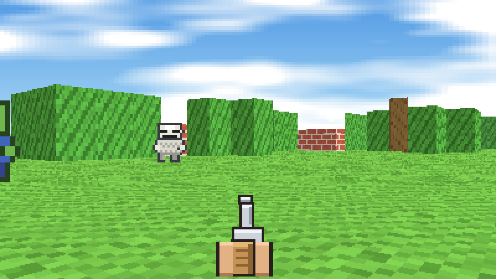

# 方块荒野 BLOCKWILD

> 一片程序生成的方块大陆，怪物从林子、废墟和沙漠里不断涌来。找到补给箱换更好的枪，活得更久，走得更远。

开放世界 · 第一人称像素射击 · 肉鸽词条 · 支持局域网联机
**纯浏览器 JavaScript，零依赖、零构建、零外部资源**（音效用 WebAudio 实时合成，美术用代码光栅化）。



## 🎮 在线试玩

<https://djdj45-SSH.github.io/blockwild-game/>

打开即可玩**单人模式**，手机可用（横屏 + 双虚拟摇杆）。

> ⚠️ 在线版只能玩单人：GitHub Pages 只托管静态文件，跑不了 `server.js`；
> 而且 https 页面会被浏览器拦截 `ws://` 的混合内容，所以联机请用下面的"本地启动"方式。

## 🚀 本地启动

需要 [Node.js](https://nodejs.org/)（仅用于起服务，无任何 npm 依赖）。

```bash
node server.js
```

终端会打印本机与局域网地址：

```
本机:      http://localhost:8080
局域网:    http://192.168.1.5:8080   ← 发给队友 / 手机
```

- **单人**：打开地址 → 填名字 → 点"单人开始"
- **联机**：任意一台机器跑 `node server.js`，其他人用浏览器打开局域网地址 → 填名字 → 点"局域网联机"。**人数无上限。**

也可以把 `index.html` 当纯静态页直接托管（只支持单人模式）。

## 🕹 操作

| 按键 | 功能 |
| --- | --- |
| `W` `A` `S` `D` | 移动（`SHIFT` 疾跑，后退不能疾跑） |
| 鼠标 | 瞄准 / 转视角（点击画面锁定指针） |
| 左键 | 射击 |
| `R` | 装填 |
| `1` `2` `3` | 切换武器 |
| `F` | 救援倒地队友 |
| `ESC` | 暂停 · `M` 静音 |

设置里可改音量 / 鼠标灵敏度 / 画质 / 队友伤害，并支持 13 项键位重绑（存 localStorage）。

**移动端**（横屏）：左半屏浮动摇杆移动，右半屏拖拽转视角，右下射击 / 装填 / 换枪 / 救援，左下疾跑，右上暂停。竖屏会提示"请横屏游玩"。

## 📖 玩法

- **程序生成世界**：192×192 格开放世界，按种子生成群系、地形、POI（废墟 / 树林 / 沙漠）与补给箱；同一个种子逐格一致。
- **肉鸽词条层**：5 档稀有度、14 种武器词条、14 种角色 Perk 三选一；每把枪 = 定义 + 稀有度 + 词条实例。
- **威胁导演**：威胁等级随存活时间上升，怪物从可达区域刷出，远处实体休眠以控制开销。
- **友军伤害与救援**：队友之间有伤害（默认 35%，可调至关闭 / 100%）；倒地后进入爬行流血状态，队友按住 `F` 救援 2 秒。
- 小地图：黄点 = 补给箱，蓝点 = 队友，橙点 = 倒地队友。

## 🗂 项目结构

```
index.html            入口（按顺序加载下列脚本，全相对路径）
css/style.css         界面样式
server.js             零依赖静态托管 + 手写 WebSocket + 权威模拟
src/
  core.js             命名空间 / 数学 / 种子化 PRNG / 事件总线
  art.js              程序化像素美术与贴图生成
  audio.js            WebAudio 音效合成（无外部音频文件）
  sim/                模拟层（Node 与浏览器共用同一份代码）
    weapons.js        武器定义
    roguelike.js      稀有度、武器词条、角色 Perk
    world.js          地图生成、墙高表、流场寻路
    entities.js       玩家 / 敌人 / 子弹 / 掉落物
    sim.js            固定 30Hz 主循环与规则
    snapshot.js       二进制快照编解码
  client/
    render.js         软件光栅化渲染器（分区高度 / 纹理平铺）
    hud.js            HUD、选卡、结算
    settings.js       设置与键位持久化
    net.js            WebSocket 客户端 + 本地预测 + 平滑校正
    touch.js          移动端双虚拟摇杆
    game.js           主控与状态机
tools/
  verify.js           57 项断言 + PNG 导出（改动后必跑）
  nettest.js          同机双客户端连真实 server.js
```

## 🧠 技术要点

- **软件光栅化**：渲染成本 ≈ 内部分辨率像素数，与地图大小基本无关，因此放大世界几乎不增加渲染开销。
- **固定步长 30Hz + 种子化 PRNG**：联机一致性的前提。
- **服务端权威 + 浏览器复用同一套 sim**：单人 = 本地权威，联机 = 服务端权威，渲染层零分支。
- **世界靠 seed 同步**：不传地图数据；快照走二进制 + AOI 裁剪，带宽随人数线性增长。
- **两级寻路**：近处局部 BFS 流场，远处 chunk 级 A\*；远处实体休眠。
- 每个玩家的局部流场坐标计算必须用 `Math.floor`（用 `Math.round` 会让站在格角的实体吸附到隔壁格、产生零向量而永久冻结）。

## 🛠 开发

```bash
node tools/verify.js     # 57 项断言 + 导出截图
node tools/nettest.js    # 起真实 server.js，双客户端连通性验证
```

## 📄 许可

个人学习 / 娱乐项目，可自由查看与试用。
